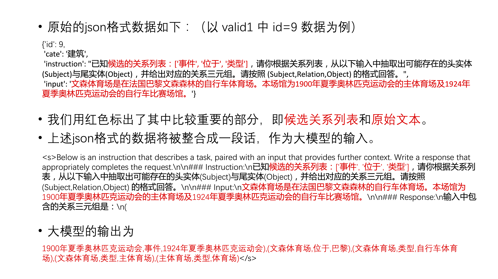
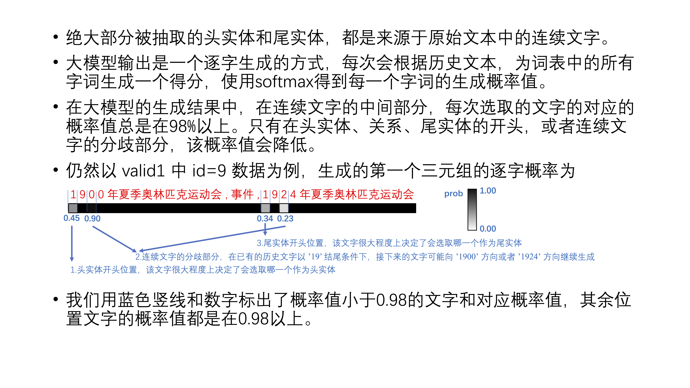
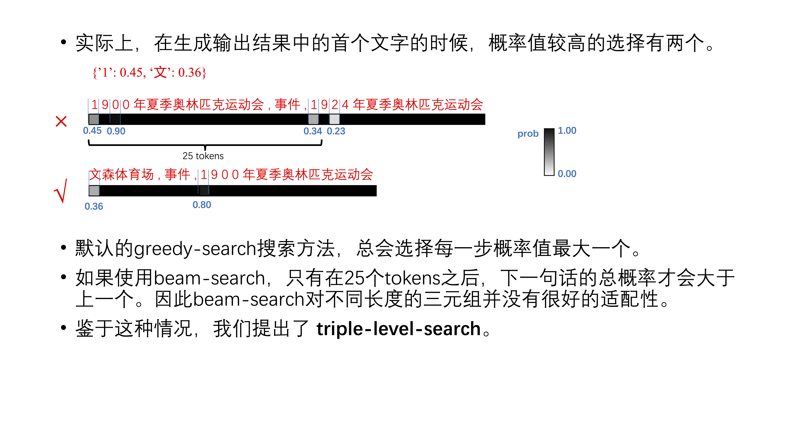

## Report of InstructKGC

我们的方案主要关注通过设计多条知识生成路径，并将不同路径上抽取的知识进行组合，从而提升在单一大模型的基础上的知识图谱构建的效果。具有以下创新点：

1. 生成句子时的 `triple-level-search` 方法。区别于 `transformers` 库默认提供的 `greedy-search` 和 `beam-search` 方法，`triple-level-search` 方法会保留每种分支的可能，直到当前三元组生成完成，因此在面对不同长度的三元组时具备更好的自适应能力。
2. `Tail-first-model` 的训练。原版的 Zhixi 大模型在生成三元组时是按照 (head, relation, tail) 的顺序，我们将其称作 `head-first-model`。在原版模型的基础上，我们使用 LoRA 方法进行模型微调，在比赛提供的较少的训练数据上进行训练，得到了按照 (tail, relation, head) 的顺序生成三元组的 `tail-first-model` 模型。在实际推断过程中，当 `head-first-model` 和 `tail-first-model` 生成了等同的三元组时，我们有更大的置信度认为这个三元组是一个正确的结果。
3. 通过打乱 relation_set 的顺序，以及预提供 `<head, rel>` 对或者 `<tail, rel>` 对的形式，来干涉知识图谱构建大模型生成结果的过程，从而得到更多的候选三元组。这也可以看作是另一种 prompt 的形式。这是因为大模型生成句子是一个逐 token、遵循条件概率的过程，relation 的生成顺序和已有的三元组都会影响大模型后续的生成。
4. 从候选三元组的集合中选取最终结果的算法流程。这里主要是一套手动编写的规则，其核心在于，优先选取 `head-first-model` 和 `tail-first-model` 共有的结果，以及对特定 relation 手动制定的处理规则等。

在本文档中，我们将按照时间顺序，介绍我们的方案的发展历程，总共分为4个章节

1. Triple-level-search 的提出，对应上面的创新点 1
2. 打乱 relation_set 的顺序取总得分最大值，对应上面的创新点 3
3. Tail-first-model 的提出，对应上面的创新点 2
4. 最终方案的形成，对应上面的创新点 3、4

受时间限制，目前该方法描述文档仍然较为简略。我们可能会计划进一步撰写评测论文，并在不久后进行公开。

### 一、Triple-level-search

首先我们先介绍数据集格式，大模型的输入格式和输出格式。以 valid0.txt 中的 id=9 的句子为例。

为简便起见，在后续的介绍中，我们只会罗列上图中红色文字的部分，即**候选关系列表**、**原始文本**和**模型输出**。

大模型的输出文字是一个逐字生成的过程。首先我们分析一下使用大模型进行知识图谱抽取时的逐字概率值。

鉴于以上情况，我们提出了 `triple-level-search`，具有以下特点：

1. 该方法会保留每种分支的可能，直到当前三元组生成完成，再选择概率最大的分支。
2. 在 triple-level-search下，我们设置了 max 和 heuristic 两种搜索方式。对于后者，如果两个分支的概率差小于20%，我们会优先选取头实体/尾实体在句子中位置更靠前的分支。

### 二、打乱 relation_set 的顺序取总得分最大值

在测试 `triple-level-search` 的过程中，我们发现，当选择生成的不同方向时，除了当前三元组外，后续生成的三元组也会发生改变。这是因为大模型输出文字可以看作是一个条件概率的过程，已经生成的三元组会影响后续三元组的生成。

参见 `utils.py` 中的 `split_triple_probs` 函数，我们计算每个三元组中所有tokens概率得分的乘积，作为该三元组的分数。进一步的，计算所有三元组的分数的平均值，作为该生成序列的得分。我们通过打乱 relation_set 获得多个生成序列，从中选择分数最高的结果。

### 三、Tail-first-model

在上一步的基础上，我们考虑如何更有效的集成不同生成序列中的三元组结果。我们把不同生成序列中所有三元组的结果取并，作为候选集合。如果选取候选集合中的所有三元组，它的召回率必然高于只选取单条序列的结果。那么接下来的问题是，如何对候选集合中的三元组进行筛选，从而进一步提升结果的准确率。

我们尝试过利用 chatglm2 对结果进行后处理，判断每个三元组是否正确。这确实带来的一定的效果提升，但 chatglm2 的判断结果肉眼可见有很多错误，这可能是因为 chatglm2 的训练数据集中只有较少部分与知识图谱抽取相关。

我们也尝试过在训练集上进一步训练 Zhixi 基准大模型，但效果总是倾向于变差。另外，进一步训练后的大模型显得更加武断，这表现为生成序列时的分支数变少，而且很多的三元组的分数都趋近于100%。这可能与训练的过拟合有关，因为基准大模型使用的知识图谱构建相关的数据要远多于比赛提供的训练数据（百万 vs 5千），进一步训练时很容易在比赛训练数据上过拟合。

基于以上原因，1. 为了利用百万级别的知识图谱抽取数据，我们打算尽量不使用除基准大模型之外的其他大模型，2. 由于过拟合原因，原始大模型的 `head-first` 的三元组生成很难进一步挖掘潜力。在使用 chatglm2 对结果进行后处理的过程中，我们发现给定 `<tail, rel>` 询问 chatglm2 头实体的方法，这种方法表现出了一定优势。因为我们在 Zhixi 基准大模型的基础上，训练了一个 `tail-first-model` 的 LoRA 模型。

在实际推断过程中，当 `head-first-model` 和 `tail-first-model` 生成了等同的三元组时，我们有更大的置信度认为这个三元组是一个正确的结果。

### 四、最终方案的形成

由于我们参赛时间较晚，在完成了 `tail-first-model` 的训练后，已经来到初赛的最后一周了。因此在初赛+复赛的最后10天左右时间里，我们主要在改进算法流程中的整体规则，没有再尝试其他的模型或者方案。

主要的算法流程如下：

1. 打乱 relation_set 顺序，对每个原始文本生成多条结果序列。结果序列中所有三元组取并集作为候选集合。该步骤位于 `gen_end2end.py` 文件中。后续步骤均位于 `main.py` 文件中。
2. 从候选集合头实体中选取位于原始文本最开头且最长的头实体，作为该原始文本主要描述的对象 mainitem。尝试以每个 <mainitem, rel> 对为开头继续进行生成，将结果加入到候选集合。这一步可以进一步提升召回率。
3. 对候选集合进行调整。如存在 (A,别名,B), (B,位于,C)，那么把后者改为 (A,位于,C)等。这一部分主要参加  `main.py` 文件中和 merge\_map 有关的规则。
4. 对候选集合中的每个 <tail, rel> 对，使用训练得到的 `tail-first-model` 进行头实体的生成。如果生成的头实体和候选集合相匹配，把它加入到最终结果。
5. 一些其他规则下的调整。例如：如果同时存在 <a,rel,b> 和 <b,rel,a>，那么优先选择在候选集合中出现次数更多或平均得分更高的三元组；如果同时存在 <a,rel0,b>, <a,rel0,c> 和 <a,rel1,c>，那么优先选择 <a,rel0,b> 和 <a,rel1,c>。
